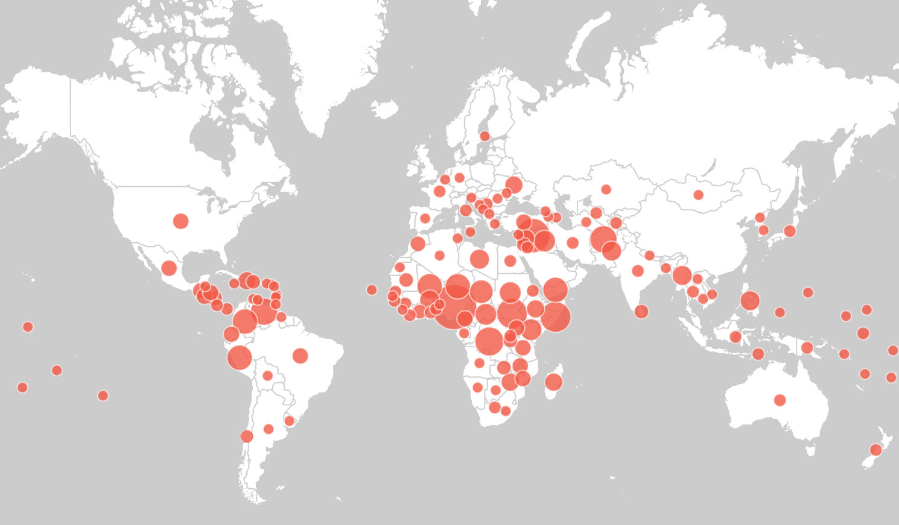

***

 

Humanitarian aid groups all over the world use websites such as [ReliefWeb](https://reliefweb.int/) to coordinate efforts in the fight against global violence, hunger, and instability. Currently, this information is posted in the form of lengthy documents detailing their work and goals. Using data mining and visualization techniques we hope to create greater fluidity and speed of communication in order to facilitate cooperation across multiple regions. Using interactive graphs, charts, and maps, humanitarian organizations can find other countries to cooperate with in combating some of the world's most urgent crises such as gender-based violence, sanitation, and forced displacement.  

*[Keyword Visualizations](#keyword-visualization)*  | 
----------------------------------------------------|---------------------------------
[Cash fundraising](#cash-fundraising)               |[Water, sanitation, and hygiene](#Water-sanitation-and-hygiene)
[Critical situations](#critical-situations)         |[Repatriation efforts](#Repatriation-efforts)
[Gender-based violence](#Gender-based-violence)     |[Protection](#Protection)
*[Interactive table](#Interactive table)*           |

###Keyword visualization

####Cash fundraising

Fundraising is one of the most essential aspects of humanitarian aid. Using tools such as data visualization, humanitarian groups will be able to communicate with other efforts and work together in raising funds.

####Critical situations

In the most urgent situations, communication is key. Using keyword detection we can visualize which situations are time-sensitive.

####Repatriation efforts

Repatriation is an international effort. The complications of immigration and international travel mean that information is essential. Data-mining techniques allow us to see which countries are working towards repatriation most frequently.

####Gender-based violence

####Protection

####Water, sanitation, and hygiene

####Interactive table